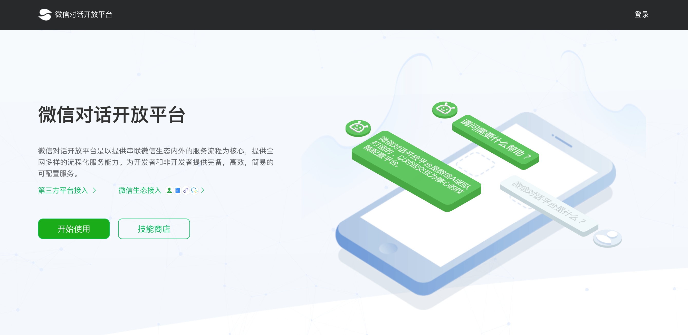

# wechaty-weixin-openai

[](https://www.npmjs.com/package/wechaty-weixin-openai)
[](https://github.com/wechaty/wechaty-weixin-openai/actions?query=workflow%3ANPM)

[Weixin OpenAI](https://openai.weixin.qq.com/) is a cloud-based Natural Language Processing (NLP) service that easily creates a natural conversational layer over your data.

Wechaty Weixin OpenAI plugin enables your bot with Weixin OpenAI skills


[](https://github.com/wechaty/wechaty-weixin-openai)
[](https://github.com/Wechaty/wechaty)
[](https://www.typescriptlang.org/)

## Introduction

Wechaty Weixin OpenAI Plugin helps you to answer questions in WeChat with the power of <https://openai.weixin.qq.com>.



## Requirements

1. Node.js v12+
1. Wechaty v0.40+
1. This Weixin OpenAI Plugin
1. Registration of Weixin OpenAI platform
1. A bot in Weixin OpenAI platform

## Usage

```ts
import { Message, Wechaty }  from 'wechaty'
import {
  WechatyWeixinOpenAI,
  AIBotRequestResponse,
  SentimentData
}                            from 'wechaty-weixin-openai'

const config = {
  mention: true, // default true: require at the bot in room.
  room: true,
  contact: true, // enable direct message.

  /**
   * Weixin OpenAI config
   */
  token: 'your-valuable-token',
  encodingAESKey: 'very-secret-encoding-key',

  /**
   * Decide whether the `preAnswerHook` function have the
   * `sentiment` argument passed.
   */
  includeSentiment: true,

  /**
   * No answer from Weixin OpenAI will call the below callback function
   */
  noAnswerHook: (message: Message) => { console.log(`No Answer Message: ${message}`) }

  /**
   * Will be called before the answer really replied by the bot
   * In the hook function, the answer that going to be answered
   * and sentiment data will be passed into the function
   *
   * If the function returns false, this function will block
   * further process of the message. With this, you can get the
   * answer from the Weixin OpenAI and decide you want to use
   * it with your own logic
   */
  preAnswerHook: (
    message: Message,
    answer: AIBotRequestResponse,
    sentiment?: SentimentData,
  ) => {
    console.log(`PreAnswerHook() with message: ${message}, answer: ${answer} and sentiment: ${sentiment}`)
  }
}

const WeixinOpenAIPlugin = WechatyWeixinOpenAI(config)

const wechaty = new Wechaty()
wechaty.use(WeixinOpenAIPlugin)
```

### 1 Configure Weixin OpenAI

1. `config.token`: Token for Weixin OpenAI
1. `config.encodingAESKey`: Encoding AES key for Weixin OpenAI

### 2 Language of Questions

1. `config.language`: If set to a language ('chinese', 'english', etc), then the plugin will only reply message text in that specified language. (default: match all languages)

### 3 Matchers & Skipper

1. `config.contact`: Whether to allow direct message to be sync with ticket reply. `false` to deny all, `true` for allow all; Supports contact id(`string`) and contact name(`RegExp`). You can also mix them in array.
1. `config.room`: The room id of your service WeChat room.
1. `config.skipMessage`: If set it to `string` or `RegExp`, then the message text that match the config will not be processed by the plugin. Array supported.

### 4 Hook functions

1. `config.noAnswerHook`: This is an optional argument, if this function is defined, when Weixin OpenAI returns an answer that actually matched nothing, this function will be called, which allows you to do other logic when the Weixin OpenAI bot can not answer the question automatically for you, such as push your own contact card or create a room with the bot and you together.
1. `config.preAnswerHook`: This hook function is called before the real answer action is taken. In this hook function, you can get the message and the answer returned from Weixin OpenAI. You can add your own logic to determine whether this message should be answered by Weixin OpenAI automatically or not. Returning `false` in the hook function will prevent further code to be executed.

### 5 NLP related functions

1. `config.includeSentiment`: This will decide whether you want to append sentiment data analyzed by Weixin OpenAI into the `preAnswerHook` function.

## Environment Variables

The following two environment variables will be used if the required information is not provided by the config.

### 1 `WECHATY_WEIXIN_OPENAI_TOKEN`

`process.env.WECHATY_WEIXIN_OPENAI_TOKEN` will be used if the `config.token` is not provided.

### 2 `WECHATY_WEIXIN_OPENAI_ENCODING_AES_KEY`

`process.env.WECHATY_WEIXIN_OPENAI_ENCODING_AES_KEY` will be used if the `config.encodingAESKey` is not provided.

## History

### master

### v0.2 (Jun 29, 2020)

1. Init code base from wechaty-plugin-qnamaker
1. Weixin Open AI integration
1. Add aibot api integration with Weixin OpenAI
1. Add `noAnswer

## Contributors

[](https://sourcerer.io/fame/windmemory/wechaty/wechaty-weixin-openai/links/0)
[](https://sourcerer.io/fame/windmemory/wechaty/wechaty-weixin-openai/links/1)
[](https://sourcerer.io/fame/windmemory/wechaty/wechaty-weixin-openai/links/2)
[](https://sourcerer.io/fame/windmemory/wechaty/wechaty-weixin-openai/links/3)
[](https://sourcerer.io/fame/windmemory/wechaty/wechaty-weixin-openai/links/4)
[](https://sourcerer.io/fame/windmemory/wechaty/wechaty-weixin-openai/links/5)
[](https://sourcerer.io/fame/windmemory/wechaty/wechaty-weixin-openai/links/6)
[](https://sourcerer.io/fame/windmemory/wechaty/wechaty-weixin-openai/links/7)

## Author

[Yuan Gao](https://github.com/windmemory) ([高原](https://www.linkedin.com/in/windmemory)),
CTO & Co-founder of Juzi.bot, \<gaoyuan@juzi.bot\>

## Copyright & License

- Code & Docs © 2020 Yuan Gao \<gaoyuan@juzi.bot\>
- Code released under the Apache-2.0 License
- Docs released under Creative Commons
