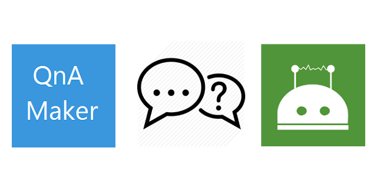

# wechaty-plugin-qnamaker

[](https://www.npmjs.com/package/wechaty-plugin-qnamaker)
[](https://github.com/wechaty/wechaty-plugin-qnamaker/actions?query=workflow%3ANPM)

[QnA Maker](https://qnamaker.ai) is a cloud-based Natural Language Processing (NLP) service that easily creates a natural conversational layer over your data.

Wechaty QnAMaker Plugin can be used to find the most appropriate answer for WeChat users, from your custom knowledge base (KB) of information.



[](https://github.com/wechaty/wechaty-plugin-qnamaker)
[](https://github.com/Wechaty/wechaty)
[](https://www.typescriptlang.org/)

## Introduction

Wechaty QnAMaker Plugin helps you to answer questions in WeChat with the power of <https://QnAMaker.ai>.

## Usage

```ts
import { WechatyQnAMaker } from 'wechaty-plugin-qnamaker'

const config = {
  at: true, // default true: require at the bot in room.
  room: true,
  contact: true, // enable direct message.
  language: undefined,  // not set or undefined to match all languages.

  endpointKey: '705a3468-12bb-4e10-a314-7daa947f18d6',
  knowledgeBaseId: '254e33ad-ca6d-405d-980d-dbd3615e2605',
  resourceName: 'wechaty',
}

const QnAMakerPlugin = WechatyQnAMaker(config)

const wechaty = new Wechaty()
wechaty.use(QnAMakerPlugin)
```

1. `config.contact`: Whether to allow direct message to be sync with ticket reply. `false` to deny all, `true` for allow all; Supports contact id(`string`) and contact name(`RegExp`). You can also mix them in array.
1. `config.room`: The room id of your service WeChat room.
1. `config.language`: If set to a language ('chinese', 'english', etc), then the plugin will only reply message text in that specified language. (default: match all languages)
1. `endpointKey`: Endpoint Key for QnAMaker.ai
1. `knowledgeBaseId`: Knowledge Base ID for your knowledge base (KB)
1. `resourceName`: Resource Name for your Cognitive Service. (for example, `wechaty` is the Resource Name for `https://wechaty.azurewebsites.net`)

## Environment Variables

The following two environment variables will be used if the required information is not provided by the config.

### 1 `WECHATY_PLUGIN_QNAMAKER_ENDPOINT_KEY`

`process.env.WECHATY_PLUGIN_QNAMAKER_ENDPOINT_KEY` will be used if the `config.endpointKey` is not provided.

### 2 `WECHATY_PLUGIN_QNAMAKER_KNOWLEDGE_BASE_ID`

`process.env.WECHATY_PLUGIN_QNAMAKER_KNOWLEDGE_BASE_ID` will be used if the `config.knowledgeBaseId` is not provided.

### 3 `WECHATY_PLUGIN_QNAMAKER_RESOURCE_NAME`

`process.env.WECHATY_PLUGIN_QNAMAKER_RESOURCE_NAME` will be used if the `config.resourceName` is not provided.

## Example

Our Friday BOT are using `wechaty-plugin-qnamaker` to connect our WeChat conversations with QnAMaker.

You can read the source code from: <https://github.com/wechaty/friday/blob/master/src/plugins/qnamaker.ts>

## History

### master

### v0.2 (Jun 29, 2020)

1. Init code base
1. QnAMaker integration
1. Add Language Detecter to limit the plugin to only answer a specific language(s)

## Contributors

[](https://sourcerer.io/fame/huan/wechaty/wechaty-plugin-qnamaker/links/0)
[](https://sourcerer.io/fame/huan/wechaty/wechaty-plugin-qnamaker/links/1)
[](https://sourcerer.io/fame/huan/wechaty/wechaty-plugin-qnamaker/links/2)
[](https://sourcerer.io/fame/huan/wechaty/wechaty-plugin-qnamaker/links/3)
[](https://sourcerer.io/fame/huan/wechaty/wechaty-plugin-qnamaker/links/4)
[](https://sourcerer.io/fame/huan/wechaty/wechaty-plugin-qnamaker/links/5)
[](https://sourcerer.io/fame/huan/wechaty/wechaty-plugin-qnamaker/links/6)
[](https://sourcerer.io/fame/huan/wechaty/wechaty-plugin-qnamaker/links/7)

## Author

[Huan LI](https://github.com/huan) ([李卓桓](http://linkedin.com/in/zixia)),
Microsoft Regional Director & AI MVP, \<zixia@zixia.net\>

[](https://stackexchange.com/users/265499)

## Copyright & License

* Code & Docs © 2020 Huan LI \<zixia@zixia.net\>
* Code released under the Apache-2.0 License
* Docs released under Creative Commons
